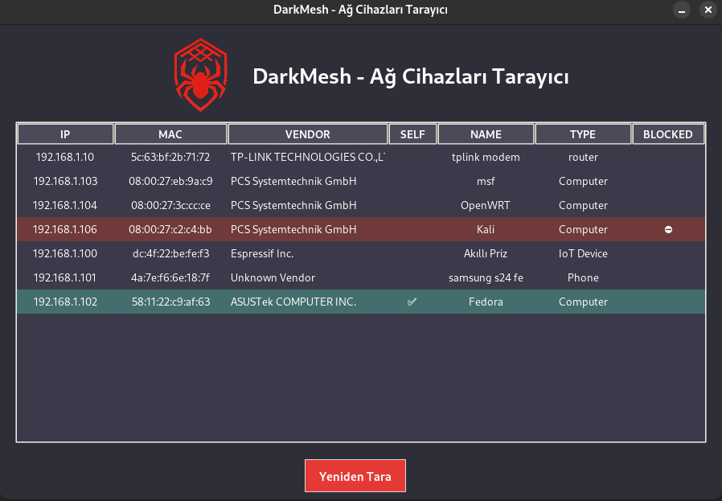
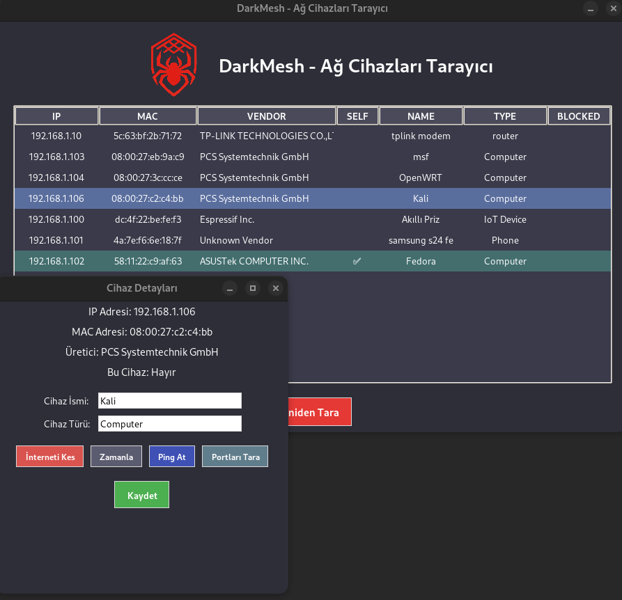
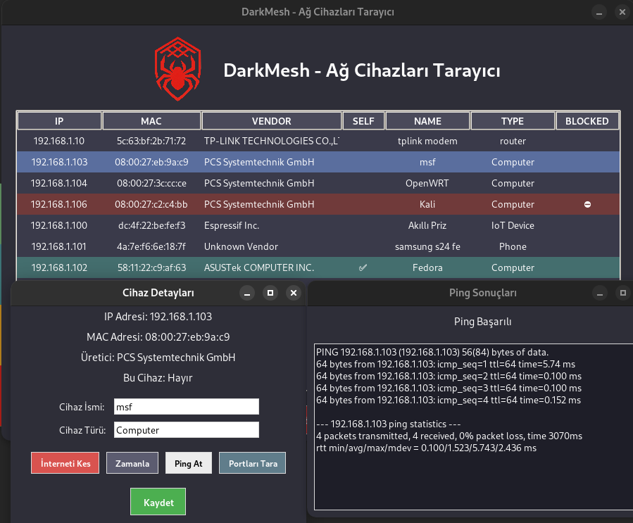
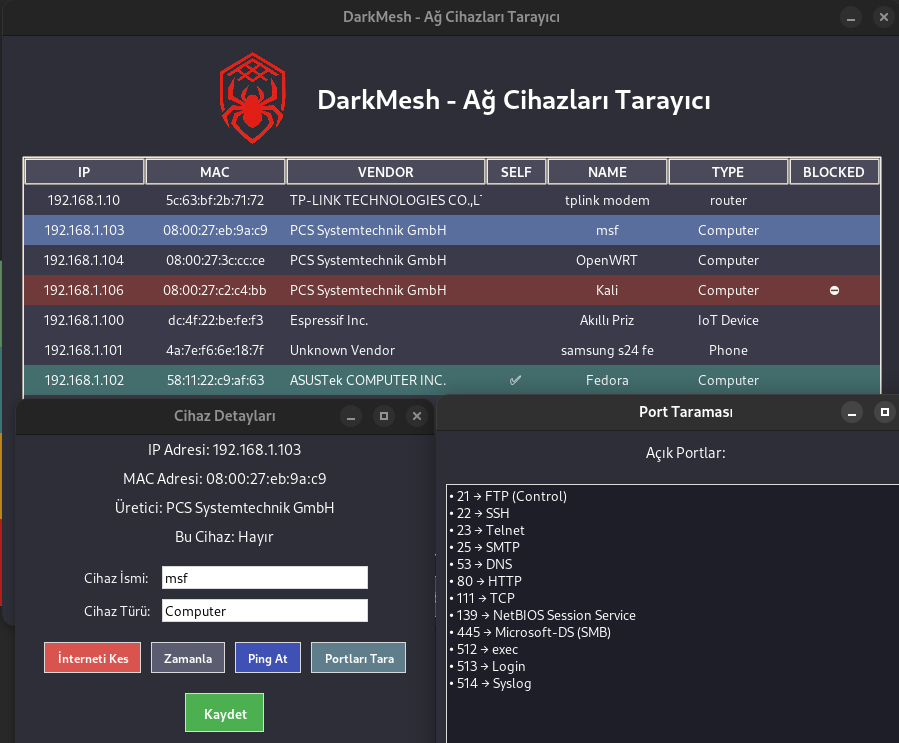
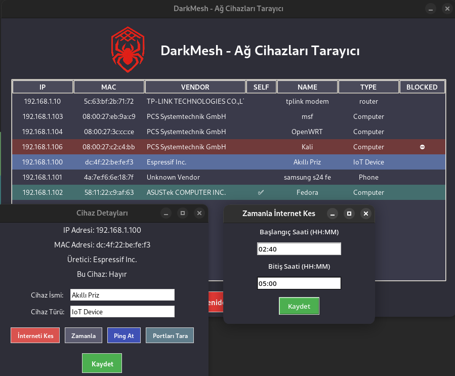

# 🕷️ DarkMesh - 🇹🇷Ağ Cihazları Tarayıcı & Erişim Kontrol Paneli/ 🇬🇧 Network Device Scanner & Access Control Panel

 **DarkMesh**, Linux üzerinde çalışan grafik arayüzlü bir ağ izleme ve kontrol uygulamasıdır. / **DarkMesh** is a graphical network monitoring and control application running on Linux.
Raspberry Pi cihazına yüklenen **OpenWRT** ile birlikte çalışarak ağdaki cihazları tespit eder, internet erişimlerini kontrol etmenizi sağlar ve zamanlanmış kurallar ile belirli cihazların erişimini otomatik olarak engelleyebilir.
/ It works together with **OpenWRT** installed on a Raspberry Pi device to detect devices on the network, control their internet access, and automatically block them at scheduled times.

---

## 🎯 Amaç  / Purpose

Kullanıcının yerel ağında bulunan cihazları tespit etmesini, analiz etmesini ve güvenlik açısından risk taşıyan cihazlara müdahale edebilmesini sağlamaktır. / To help users detect, analyze, and take action against potentially risky devices on their local network.
Özellikle kablosuz ağlara izinsiz erişim gibi durumların önüne geçmeyi hedefler. / Especially aims to prevent unauthorized access to wireless networks.

---

## 🚀 Özellikler / Features

- 📡 **Ağ Taraması:** IP, MAC adresi ve üretici bilgisi / **Network Scan:** IP, MAC address, and vendor info
- 🧠 **Cihaz Tanımlama:** İsim ve cihaz türü girilebilir / **Device Labeling:** Add custom name and type
- 🌐 **Ping Atma:** Cihazın ağa yanıt verip vermediğini ölçer / **Ping Test:** Checks if the device responds to network
- 🔐 **Port Taraması:** Sık kullanılan TCP portları üzerinden açık servislere bakar / **Port Scan:** Scans popular TCP ports for open services
- ❌ **İnterneti Kesme:** Cihazın internet erişimini iptables ile engeller / **Block Internet:** Blocks internet via iptables
- 🔄 **İnterneti Açma:** Engellenen cihazın erişimi tekrar sağlanabilir / **Unblock Internet:** Re-enables access for blocked devices
- ⏱️ **Zamanlama Özelliği:** Belirli saatlerde otomatik internet engelleme / **Scheduler:** Automatically block access at set times
- 💻 **GUI Arayüz:** Kullanımı kolay, tamamen grafiksel arayüz (Tkinter) / **GUI Interface:** Easy-to-use interface built with Tkinter
- 📁 **Linux Uygulaması:** `.desktop` desteğiyle menüden başlatılabilir / **Linux App:** Launchable via menu with .desktop file

---

## 🧰 Kullanılan Teknolojiler / Technologies Used

- Python 3
- Tkinter (GUI)
- Flask (API sunucusu - OpenWRT'de çalışır) / Flask (API server - runs on OpenWRT)
- `iptables` (internet engelleme için) / `iptables` (for internet blocking)
- threading (asenkron işlemler) / threading (for asynchronous operations)
- `nmap` (port tarama için - OpenWRT tarafında)  / `nmap` (port scanning - on OpenWRT)
- Raspberry Pi + OpenWRT (router olarak) / Raspberry Pi + OpenWRT (as router)

---

## 🖼️ Ekran Görüntüleri / Screenshots

Ekran görüntüleri `ss/` klasöründe yer almaktadır. / Screenshots are located in the ss/ folder.

| Ana Sayfa/Home | Detaylar / Details| Ping | Port Taraması / Port Scan | Zamanlayıcı / Timer|
|-----------|----------|------|----------------|-------------|
|  |  |  |  |  |

---

## ⚙️ Kurulum / Installation

### 🖥️ 1. Ana Bilgisayar (Linux) Üzerinde  / On Main Computer (Linux)

#### Gerekli Bağımlılıklar / Required Dependencies

```bash
sudo apt install python3 python3-pip nmap -y
pip3 install requests
```
#### Fedora veya RPM tabanlı sistemler:  / Fedora or RPM-based systems:
```bash
sudo dnf install python3 python3-tkinter nmap -y
pip3 install requests
```
#### Debain için: / For Debian:
```bash
sudo apt install python3 python3-tkinter nmap -y
pip3 install requests
```
#### Depoyu Klonla: / Clone the repository:
```bash
git clone https://github.com/kullanici-adi/darkmesh.git
cd darkmesh
```
#### Uygulamayı başlat: / Launch the app:
```bash
python3 main.py
```

#### 2.Raspberry Pi Cihazına OpenWRT Kurulumu / Installing OpenWRT on Raspberry Pi
-Raspberry Pi cihazına OpenWRT kurulmalı / Install OpenWRT on the Raspberry Pi

-Raspberry Pi modeme WAN portu üzerinden bağlanmalı / Connect Raspberry Pi to modem via WAN port
 
-Ana bilgisayar (uygulamanın çalıştığı sistem) Raspberry üzerinden internete çıkmalı / Main computer should access internet through Raspberry Pi

-Böylece Raspberry Pi tüm ağ trafiğini denetleyen router olur / This way, the Raspberry Pi acts as a router that monitors all network traffic.

### 3.Raspberry Pi Üzerinde Flask API Kurulumu / Set Up Flask API on Raspberry Pi
#### Gerekli Paketleri Yükle (OpenWRT) / Install Required Packages (OpenWRT)
```bash
opkg update
opkg install python3 python3-pip
pip3 install flask flask-cors
```
#### **server.py** Dosyasını Raspberry Pi’ye Kopyala / Copy **server.py** to Raspberry Pi
```bash
scp server.py root@192.168.8.1:/root/
ssh root@192.168.8.1
python3 /root/server.py
(Raspberry IP'si farklıysa 192.168.8.1 yerine onu yaz.)
```
#### Flask Portunu Aç (5000) / Open Flask Port (5000)
```bash
uci add firewall rule
uci set firewall.@rule[-1].name='Allow-Flask'
uci set firewall.@rule[-1].src='lan'
uci set firewall.@rule[-1].dest_port='5000'
uci set firewall.@rule[-1].target='ACCEPT'
uci set firewall.@rule[-1].proto='tcp'
uci commit firewall
/etc/init.d/firewall restart
```
### 4. Ana Bilgisayarda IP Ayarlarını Yap  / Configure IP on Main Computer
#### main.py içinde Flask sunucusunun IP’sini doğru şekilde ayarlamalısın:
```bash
RASPBERRY_IP = "192.168.8.1"  # veya senin Pi'nin IP'si ne ise
```

Artık uygulama arayüzü üzerinden port tarama, ping atma, internet engelleme işlemleri doğrudan Raspberry'deki OpenWRT API’ye gönderilir. /Now, operations like port scanning, pinging, and internet blocking are directly sent to the OpenWRT API running on the Raspberry Pi through the application interface.
